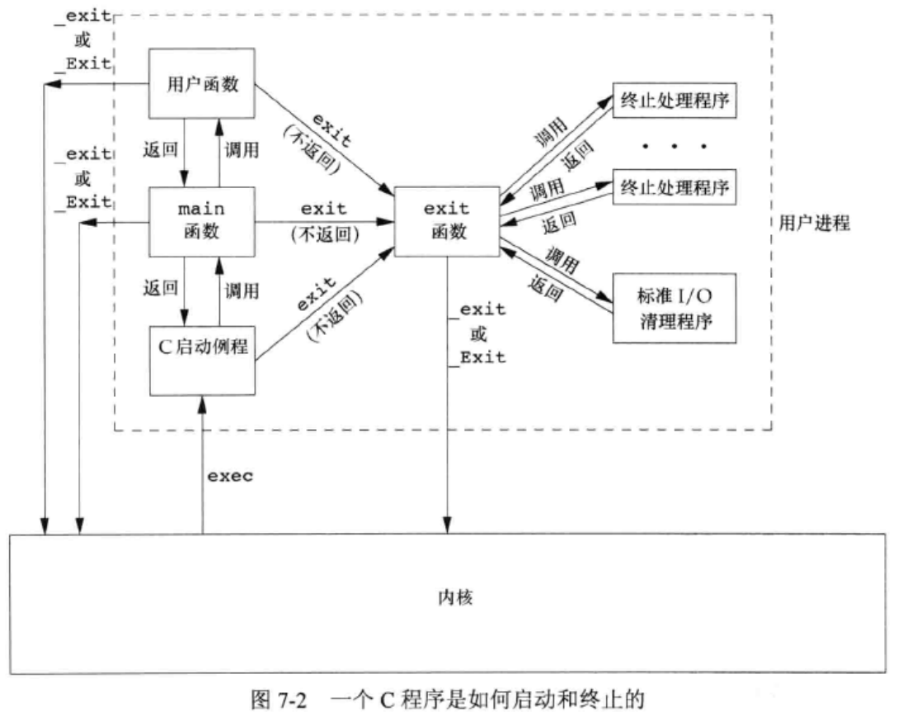

# 7.1 引言

+ 当进程执行时，其main函数是如何被调用的；
+ 命令行参数是如何传递给新进程的；
+ 典型的存储空间布局的样式；
+ 如何分配另外的存储空间；
+ 进程如何使用环境变量；
+ 进程的不同终止方式；
+ longjmp和setjmp函数以及它们与栈的交互作用；
+ 进程资源限制；

<!-- more -->

# 7.2 main函数

+ C程序总是从main函数开始执行，main函数的原型是：

  ```c
  int main(int argc, char *argv[])；
  ```

  1. argc是命令行参数的数目；
  2. argv是指向参数的各个指针所构成的数组；

+ 当内核执行C程序时，在调用main前先调用一个特殊的启动例程。可执行程序文件将此启动例程指定为程序的起始地址，由链接器设置，而链接编辑器则由C编译器调用。启动例程从内核获得命令行参数和环境变量值，然后为按上述方式调用main函数做好安排。

# 7.3 进程终止

+ 有8种方式使进程终止，其中5种为正常终止，它们是：
  1. 从 main返回；
  2. 调用 exit；
  3. 调用 _Exit 或 _exit；
  4. 最后一个线程从其启动例程返回；
  5. 从最后一个线程调用 pthread_exit；
+ 异常终止有3种，它们是：
  1. 调用 abort；
  2. 接到一个信号；
  3. 最后一个线程对取消请求做出响应；

1. 退出函数

   3个函数用于正常终止一个函数：_exit 和 _Exit立刻进入内核，exit 则先执行一些清理处理，然后返回内核。

   ```c
   #include <stdlib>
   void exit(int status);
   void _Exit(int status);
   #include <unistd.h>
   void _exit(int status);
   ```

   exit 函数总是执行一个标准 I/O库的清理关闭操作：对于所有打开流调用 fclose函数。输出缓冲中的所有数据都被冲洗。

   3个推出函数都带一个整型参数，称为**终止状态**或**退出状态**，下面进程终止状态是未定义的：

   1. 调用这些函数时不带终止状态；
   2. main执行了一个无返回值 return语句；
   3. main没有声明返回类型为整型。

   main函数返回一个整型值与用该值调用 exit是等价的。在main中 exit(0); 等价于 return(0);

2. 函数 atexit

   按照ISO C的规定，一个进程可以登记多至32个**终止处理程序**函数，这些函数将由 exit自动调用。并调用 atexit函数来登记这些函数。

   ```c
   #include <stdlib.h>
   int atexit(void (*func)(void));			
   ```

   exit 调用这些函数的顺序与登记时候的顺序相反，若多次登记，也会多次被调用。

   

# 7.4 命令行参数

# 7.5 环境表

# 7.6 C程序的存储空间布局

# 7.7 共享库

# 7.8 存储空间分配

# 7.9 环境变量

# 7.10 函数longjmp和setjmp

# 7.11 函数getrlimit和setrlimit 